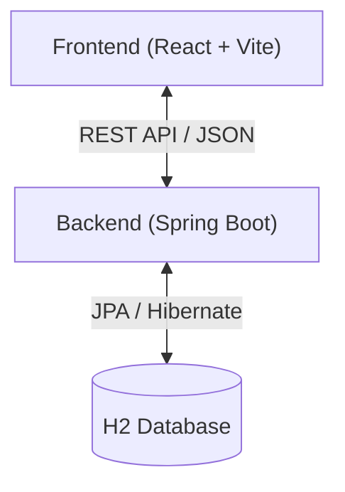

# Modern Ecommerce App

Một ứng dụng thương mại điện tử Full-stack hiện đại, hỗ trợ đa ngôn ngữ (VI/EN) và chuyển đổi tiền tệ (VND/USD), được xây dựng với kiến trúc Clean Architecture.


## 🏗 Kiến trúc Hệ thống (Architecture)

Dự án được tổ chức theo mô hình **Monorepo** Client-Server:



### 🔙 Backend (`/backend`)
*   **Framework:** Spring Boot 3.2.1
*   **Language:** Java 17 (Cấu hình cứng qua Maven Wrapper)
*   **Database:** H2 In-memory (Tự động reset khi restart app)
*   **Architecture Pattern:** Layered Architecture (Controller -> Service -> Repository)
*   **Key Features:**
    *   **Data Seeder:** Tự động tạo dữ liệu mẫu (Products, Categories) khi khởi động.
    *   **Validation:** Tích hợp Maven Checkstyle (Google Style).
    *   **CORS:** Cấu hình sẵn sàng kết nối với Frontend port 3000.

### 🎨 Frontend (`/frontend`)
*   **Framework:** React 18 + TypeScript
*   **Build Tool:** Vite (Node.js >= 22)
*   **Styling:** Bootstrap 5 (React-Bootstrap)
*   **State & Logic:**
    *   `Axios`: Client API với Interceptors.
    *   `react-i18next`: Đa ngôn ngữ (Anh/Việt).
    *   `Context API`: Quản lý tiền tệ (Global Currency State).
*   **Validation:** ESLint + Prettier + Husky (Pre-commit hooks).

---

## 🚀 Hướng dẫn Cài đặt & Chạy (Getting Started)

### Yêu cầu tiên quyết (Prerequisites)
*   **Java:** JDK 17 (Tuy nhiên dự án đã có sẵn Maven Wrapper tự động dùng Java 17 nội bộ nếu cấu hình đúng).
*   **Node.js:** Phiên bản 22 trở lên.

### 1. Khởi chạy Backend
Backend chạy tại cổng `8080`.

```bash
cd backend
# Windows (Sử dụng wrapper đã config sẵn Java 17)
./mvnw spring-boot:run
```

*Truy cập H2 Console:* `http://localhost:8080/h2-console`
*   JDBC URL: `jdbc:h2:mem:testdb`
*   User: `sa`
*   Password: `password`

### 2. Khởi chạy Frontend
Frontend chạy tại cổng `3000`.

```bash
cd frontend
npm install
npm run dev
```

*Truy cập Web:* `http://localhost:3000`

---

## ✅ Quy trình phát triển (Workflow)

Dự án sử dụng **Husky** để đảm bảo chất lượng code trước khi commit:
*   **Frontend:** Tự động chạy `eslint` fix lỗi style.
*   **Backend:** (Có thể cấu hình thêm spotless/checkstyle tại hook).

Để commit code:
```bash
git add .
git commit -m "feat: add new feature"
```

## 👥 Tác giả
Project được khởi tạo và phát triển bởi **haithvn**.
